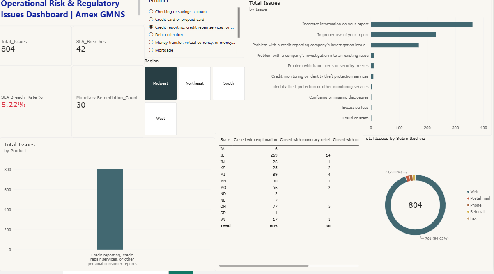
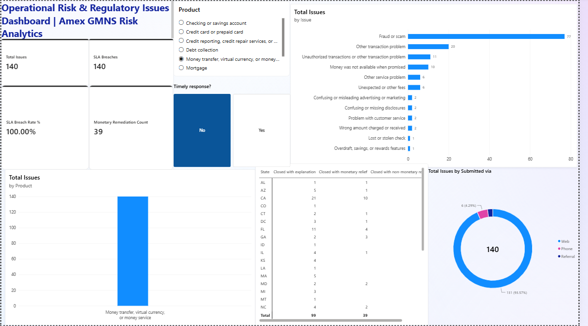
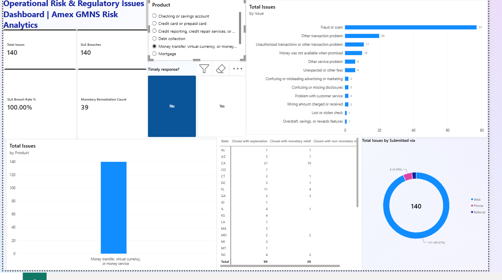
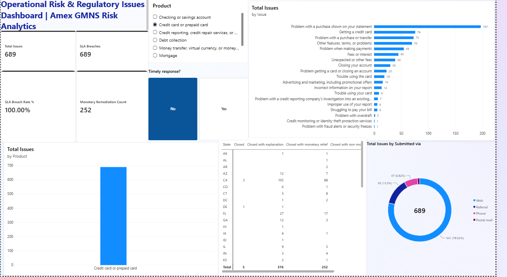
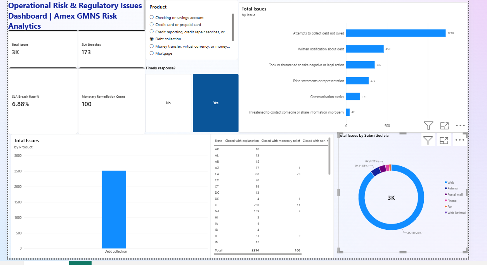
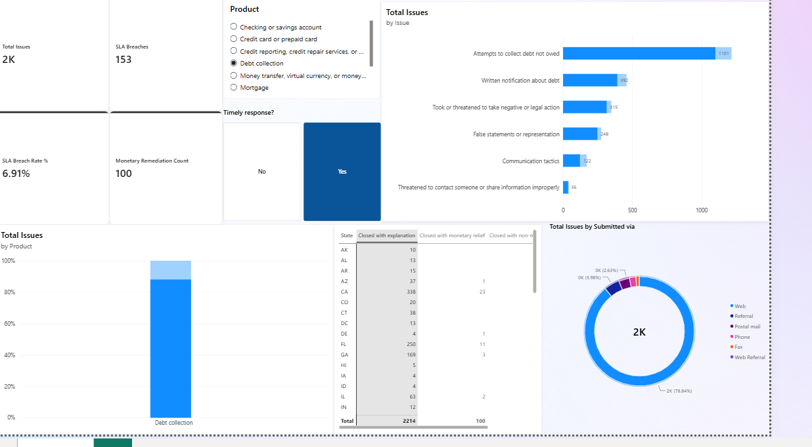
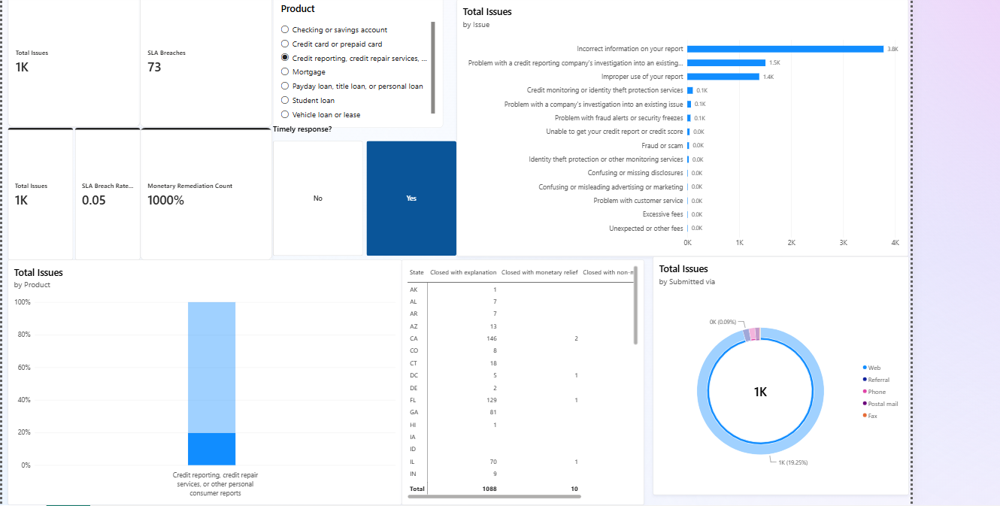

# Power BI screenshot gallery

Original user-supplied screenshots of an Amex-themed portfolio dashboard using public CFPB complaints data. This is not Amex employment or an internal Amex reporting system.

These are filtered snapshots, not refreshed reporting. The September 12 screenshots select untimely responses, so the displayed 100% breach rate is conditional on that selection. September 10 captures are development history; the last screenshot includes a monetary-count percentage formatting error and should not be treated as a final KPI presentation.

## Latest view — Midwest credit-reporting complaints

September 13, 2026: 804 complaints, 42 untimely responses (5.22%) and 30 monetary-relief outcomes. Counts reconciled against the updated saved PBIX. Product and region slicers determine this view; it is not evidence of an RLS test.

## Earlier captures

## Money transfer complaints - untimely responses

2026-09-12 205446

## Money transfer complaints - alternate capture

2026-09-12 205429

## Credit card complaints - untimely responses

2026-09-12 205421

## Debt collection - development capture

2026-09-10 131530

## Debt collection - highlighted development capture

2026-09-10 130717

## Credit reporting - development capture with formatting issues

2026-09-10 130129

